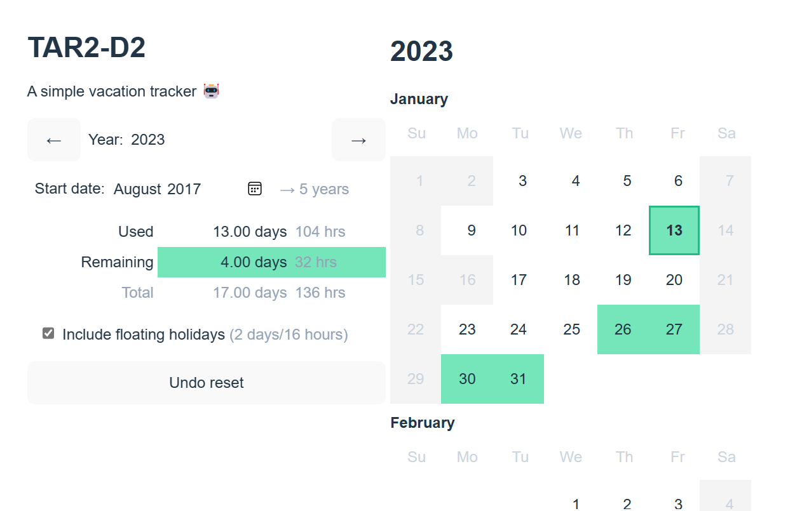

# TAR2-D2

Simple TAR (Time and Absence Reporting) replacement for tracking your time off.

[ben.stolovitz.com/tar2d2/](https://ben.stolovitz.com/tar2d2/)

## Intro

We like to track our time off. This tool helps you do it.

It stores everything in LocalStorage, so your data is private.



## Development

It's just vite.js:

```
npm install
npm run dev
```

### Deployment

```
npm run build
npm run deploy
```
